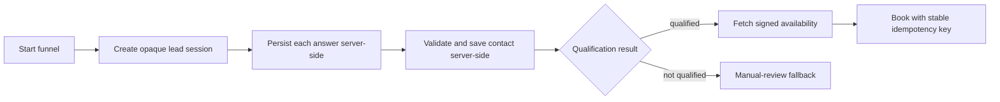
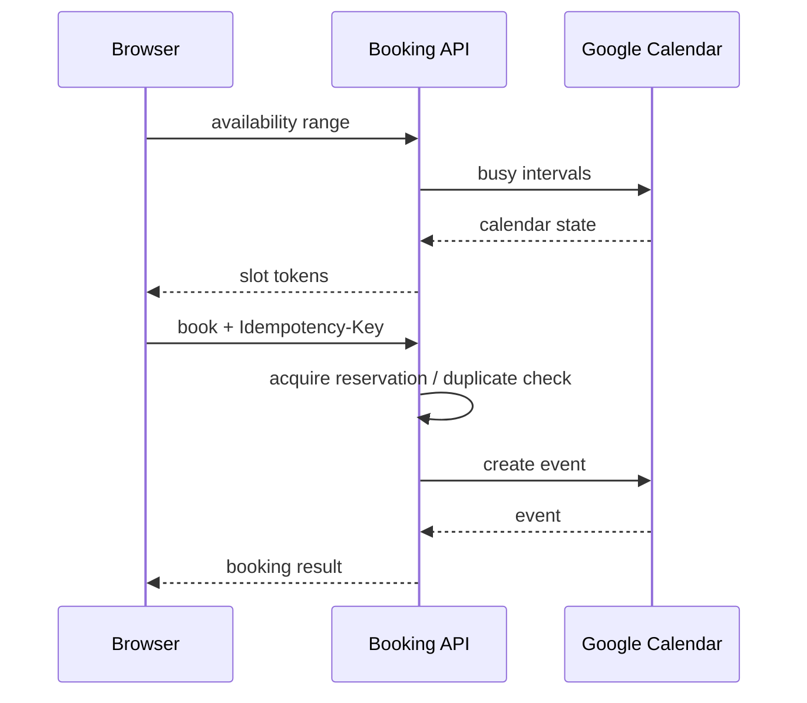

# Lead qualification and booking

Local storage now contains only the opaque resume identifiers, current step, stepper version, and a 24-hour expiry. Answers and contact fields are not persisted there. The backend remains the source of truth. The current API does not expose a full session-resume read endpoint, so answers cannot be rehydrated after a hard refresh; adding that endpoint is the safe next backend contract rather than storing personal data in the browser.
