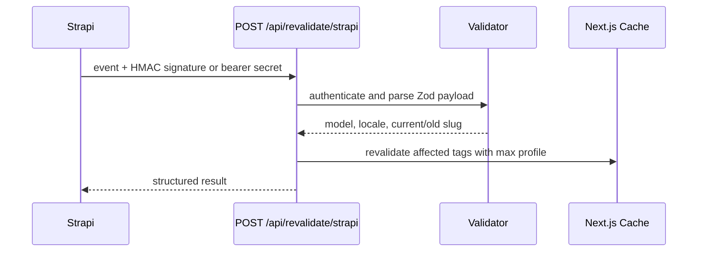

# Caching and Strapi revalidation

CMS reads use an explicit five-minute revalidation window and content tags. Draft Mode forces `no-store` and changes Strapi REST status from `published` to `draft`.

Tags include `cms:site-settings`, localized navigation/footer/page tags, localized blog index/post/category tags, and `cms:sitemap`.

The endpoint accepts `Authorization: Bearer <secret>` or `x-strapi-signature: sha256=<hex HMAC of raw body>`. It never logs the secret. Old and new slugs are invalidated when included. Configure the same random `STRAPI_WEBHOOK_SECRET` in the sender and Next.js.

When Strapi is unavailable, sitemap generation logs a structured failure and returns stable localized static entries instead of an empty sitemap.
