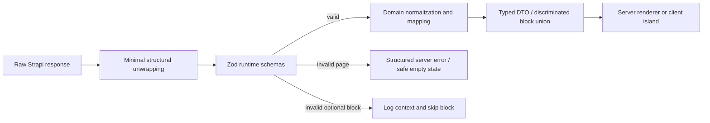

# CMS data flow and contracts

The block UID source is `client/src/features/cms/blocks/block-uids.ts`. `registry.tsx` is a `Record<CmsBlockUid, CmsBlockRenderer>`, so missing entries fail type checking. The contract test also compares this list and the registry against `server/src/content-system/blocks.json`.

The audit found 19 configured UIDs and 18 registry entries. `blocks.booking-meeting` was the missing renderer and is now covered. Runtime validation is deliberately tolerant for optional presentation fields but strict about UID, block settings enums, IDs, page locale, core article identity, navigation links, and SEO constraints.

The current `cms-page.js` remains the compatibility-facing loader and contains legacy specialized page mappers. Metadata and sitemap ownership have moved out. Further mapper extraction must preserve the large brand-proof and booking hydration contracts and should be done independently from visual changes.
