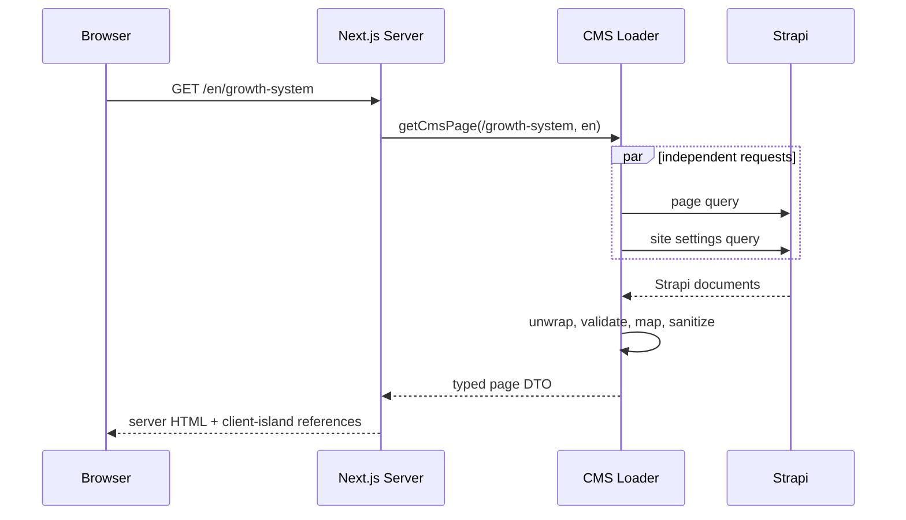
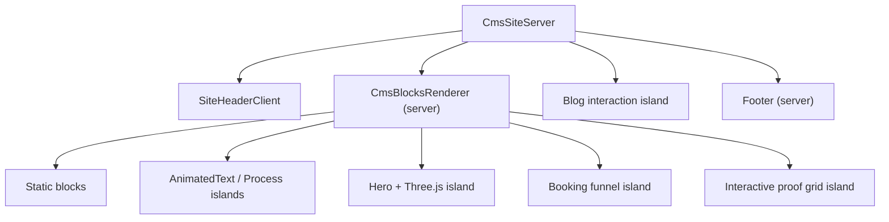

# Frontend architecture

The frontend is Next.js 16.2 with the App Router and React 19. Strapi 5.11.3 is the editorial and administrative control plane. Public pages are loaded on the server; static blocks render as Server Components and interactive features cross explicit client boundaries.

## Routing

- Legacy routes remain available: `/`, `/blog`, `/blog/:slug`, `/book-call`, and the marketing catch-all.
- Stable localized compatibility routes are handled by the same catch-all: `/en`, `/ar`, `/en/:path`, `/ar/:path`, `/en/blog/:slug`, and `/ar/blog/:slug`.
- Existing non-prefixed URLs are not forcibly redirected. Their canonical metadata points at the localized document.
- Content, leads, meetings, and editorial administration are managed exclusively through the Strapi admin panel. The Next.js application exposes no custom admin or admin-login routes.

## Published page request

## Server and client boundaries

Static blocks: page hero shell, problem, service overview, feature list, FAQ markup, final CTA shell, system flow, diagnosis, timeline, statement pair, principles, dashboard shell, and booking-meeting. Client islands: header controls, hero/WebGL, animated text, process tabs/GSAP, brand-proof carousel, booking, blog list filters, blog post table-of-contents observer, and canvas effects.

The old page-wide `CmsSiteClient` boundary was removed. The isolated demo route keeps its own client-only `MainLayout`; production marketing routes use `CmsSiteServer`.
