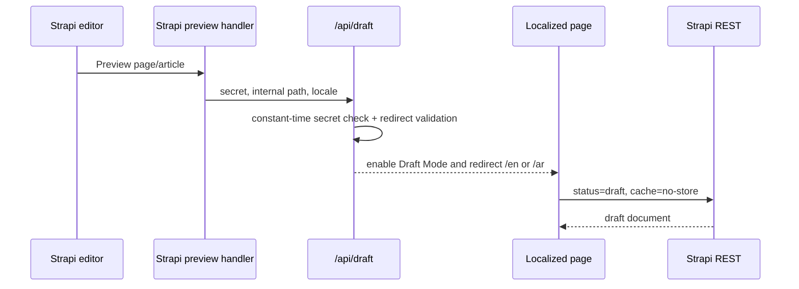

# Draft preview workflow

Set `STRAPI_PREVIEW_ENABLED=true`, `CLIENT_URL`, and the same 32+ character `STRAPI_PREVIEW_SECRET` in both applications. Strapi supports pages, blog pages, and articles. External, protocol-relative, admin, API, and demo redirects are rejected. `/api/draft/disable?path=/` exits Draft Mode using a safe internal redirect.
