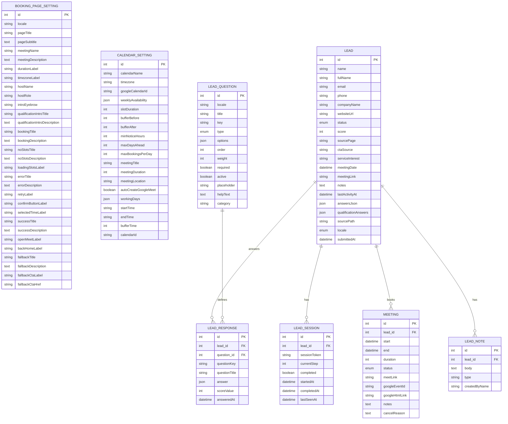
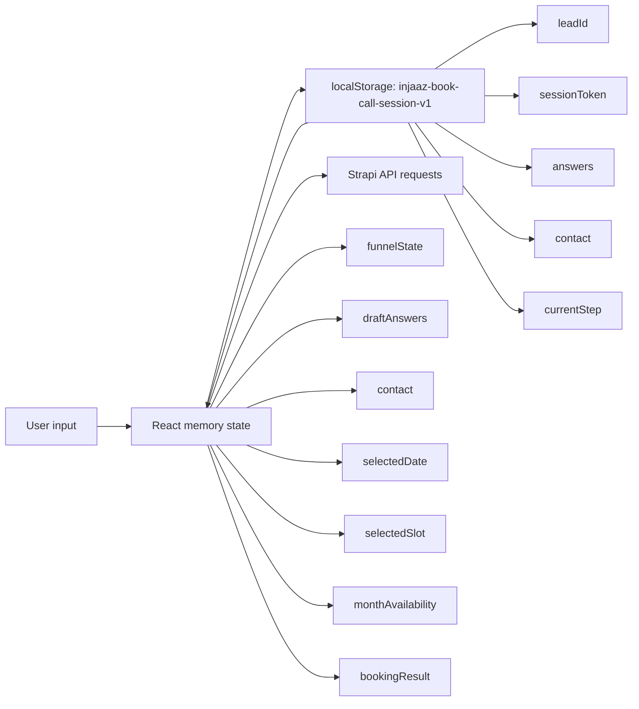
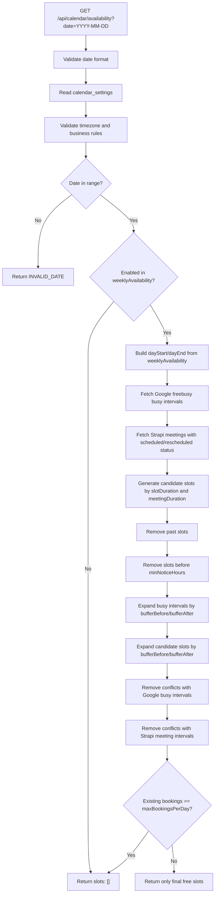
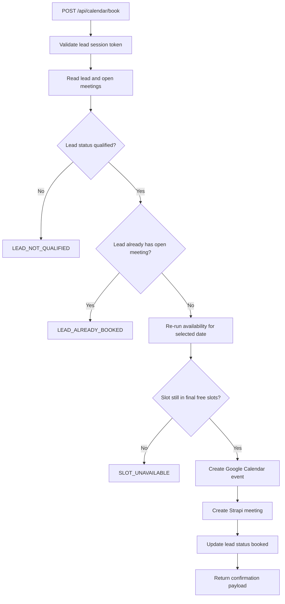

# Book Call Funnel Architecture

This document maps the `/book-call` booking funnel across the user interface, browser memory, local storage, Strapi APIs, Strapi database tables, and Google Calendar.

## Runtime Sequence

```mermaid
sequenceDiagram
  autonumber
  actor User
  participant Page as Next.js /book-call Page
  participant UI as BookCallPage UI
  participant Memory as React State
  participant LocalStorage as Browser localStorage
  participant StrapiClient as Frontend Strapi Client
  participant Strapi as Strapi REST API
  participant BookingSetting as booking_page_settings
  participant LeadQuestion as lead_questions
  participant LeadSession as lead_sessions
  participant Lead as leads
  participant LeadResponse as lead_responses
  participant CalendarSetting as calendar_settings
  participant Meeting as meetings
  participant CalendarService as Strapi Calendar Service
  participant GoogleService as Google Calendar Service
  participant Google as Google Calendar API

  User->>Page: Open /book-call
  Page->>StrapiClient: getInitialLang from cookie
  Page->>StrapiClient: fetchBookingPageSetting(locale)
  StrapiClient->>Strapi: GET /api/booking-page-setting?locale={locale}&populate=*
  Strapi->>BookingSetting: Read localized single type
  BookingSetting-->>Strapi: Localized booking copy
  alt Missing localized booking copy
    StrapiClient->>Strapi: GET /api/booking-page-setting?locale=en&populate=*
    Strapi->>BookingSetting: Read English fallback
    BookingSetting-->>Strapi: English copy
  end
  Strapi-->>StrapiClient: Booking copy

  Page->>StrapiClient: fetchLeadQuestions(locale)
  StrapiClient->>Strapi: GET /api/lead-questions?sort=order:asc&filters[active][$eq]=true&locale={locale}
  Strapi->>LeadQuestion: Read active localized questions
  LeadQuestion-->>Strapi: title, key, type, options, order, weight, required, placeholder, helpText
  alt Missing localized questions
    StrapiClient->>Strapi: GET /api/lead-questions?...&locale=en
    Strapi->>LeadQuestion: Read English fallback questions
  end
  Strapi-->>Page: Normalized questions
  Page->>UI: Render booking shell with CMS header and booking UI

  UI->>LocalStorage: Read injaaz-book-call-session-v1
  LocalStorage-->>UI: Existing leadId/sessionToken/answers/contact or null
  UI->>Memory: Initialize funnel state, answers, contact, selected date, selected slot

  loop Qualification questions
    User->>UI: Answer current question
    UI->>Memory: Store draft answer
    User->>UI: Continue
    alt No active session
      UI->>StrapiClient: startLeadSession({ sourcePage, ctaSource, locale })
      StrapiClient->>Strapi: POST /api/lead-sessions/start
      Strapi->>Lead: INSERT lead status=in_progress, locale, sourcePage, ctaSource
      Strapi->>LeadSession: INSERT sessionToken, startedAt, lastSeenAt, currentStep
      Strapi-->>StrapiClient: leadId, sessionToken
      UI->>Memory: Save leadId/sessionToken
      UI->>LocalStorage: Persist session object
    end
    UI->>StrapiClient: saveLeadAnswer({ leadId, sessionToken, questionKey, questionTitle, answer })
    StrapiClient->>Strapi: POST /api/lead-responses/save
    Strapi->>LeadSession: Validate leadId + sessionToken
    Strapi->>Lead: Read lead locale
    Strapi->>LeadQuestion: Find active question by stable key and locale
    Strapi->>LeadResponse: UPSERT answer, scoreValue, questionKey, questionTitle, answeredAt
    Strapi->>LeadSession: UPDATE currentStep, lastSeenAt
    Strapi->>Lead: UPDATE lastActivityAt
    Strapi-->>UI: Saved response
    UI->>LocalStorage: Persist answer and currentStep
  end

  User->>UI: Enter contact information
  UI->>Memory: Store contact draft
  User->>UI: Check fit
  UI->>StrapiClient: updateLeadContact({ leadId, sessionToken, contact })
  StrapiClient->>Strapi: PUT /api/leads/{leadId}/contact
  Strapi->>LeadSession: Validate leadId + sessionToken
  Strapi->>Lead: UPDATE name, email, phone, companyName, websiteUrl, status=partial
  Strapi-->>UI: Updated lead contact
  UI->>LocalStorage: Persist contact

  UI->>StrapiClient: completeLead({ leadId, sessionToken })
  StrapiClient->>Strapi: POST /api/leads/{leadId}/complete
  Strapi->>LeadSession: Validate leadId + sessionToken
  Strapi->>Lead: Read lead and locale
  Strapi->>LeadResponse: Read all answers for lead
  Strapi->>LeadQuestion: Read active localized questions
  Strapi->>LeadResponse: Recalculate scoreValue per answer
  Strapi->>Lead: UPDATE score, status qualified/unqualified, answersJson, qualificationAnswers, serviceInterest, submittedAt
  Strapi->>LeadSession: UPDATE completed=true, completedAt, lastSeenAt
  Strapi-->>UI: qualified, score, status

  alt Lead unqualified
    UI->>Memory: funnelState=UNQUALIFIED
    UI-->>User: Show CMS fallback title/description/CTA
  else Lead qualified
    UI->>Memory: funnelState=BOOKING
    UI-->>User: Show monthly booking calendar
  end

  par Month availability indicators
    loop Each visible future day in current month
      UI->>StrapiClient: fetchAvailability({ date: YYYY-MM-DD })
      StrapiClient->>Strapi: GET /api/calendar/availability?date=YYYY-MM-DD
      Strapi->>CalendarService: getAvailability(date)
      CalendarService->>CalendarSetting: Read single type calendar_settings
      CalendarSetting-->>CalendarService: timezone, weeklyAvailability, slotDuration, buffers, max rules, googleCalendarId
      CalendarService->>CalendarService: Validate date, timezone, maxDaysAhead, non-working day, minNoticeHours
      CalendarService->>GoogleService: getBusyEvents(dayStart, dayEnd, googleCalendarId, timezone)
      GoogleService->>Google: freebusy.query(timeMin, timeMax, timeZone, calendarId)
      Google-->>GoogleService: Busy intervals only, no private event details
      GoogleService-->>CalendarService: busy[{ start, end }]
      CalendarService->>Meeting: Read open meetings overlapping day
      Meeting-->>CalendarService: start/end for scheduled/rescheduled meetings
      CalendarService->>CalendarService: Generate candidate slots from weeklyAvailability
      CalendarService->>CalendarService: Remove past slots and minNoticeHours violations
      CalendarService->>CalendarService: Remove Google busy overlaps
      CalendarService->>CalendarService: Remove Strapi booked meeting overlaps
      CalendarService->>CalendarService: Apply bufferBefore and bufferAfter around busy events and candidate slots
      CalendarService->>CalendarService: Apply maxBookingsPerDay
      CalendarService-->>Strapi: Final slots only
      Strapi-->>UI: { date, timezone, slots }
      UI->>Memory: Mark day gray if slots.length > 0
    end
  and Selected day availability
    UI->>StrapiClient: fetchAvailability({ selectedDate })
    StrapiClient->>Strapi: GET /api/calendar/availability?date={selectedDate}
    Strapi-->>UI: Final free slots for selected day
    UI->>Memory: Store selected day slots/loading/error
    UI-->>User: Render selected day and available time buttons
  end

  User->>UI: Select a day
  UI->>Memory: selectedDate=day, selectedSlot=null
  UI->>StrapiClient: fetchAvailability({ selectedDate })
  StrapiClient->>Strapi: GET /api/calendar/availability?date={selectedDate}
  Strapi-->>UI: Final free slots
  UI-->>User: Show slots panel

  User->>UI: Select a slot
  UI->>Memory: selectedSlot={ start, end, label }
  UI-->>User: Show selected time and confirm button

  User->>UI: Confirm meeting
  UI->>StrapiClient: bookMeeting({ leadId, sessionToken, start, end })
  StrapiClient->>Strapi: POST /api/calendar/book
  Strapi->>LeadSession: Validate leadId + sessionToken
  Strapi->>Lead: Read lead with meetings
  Strapi->>CalendarService: ensureSlotFree(start, end)
  CalendarService->>CalendarSetting: Read and validate calendar settings
  CalendarService->>CalendarService: Re-run buildAvailabilityForDate(slot date)
  CalendarService->>GoogleService: getBusyEvents(dayStart, dayEnd)
  GoogleService->>Google: freebusy.query
  Google-->>GoogleService: Busy intervals
  CalendarService->>Meeting: Check overlapping scheduled/rescheduled meetings
  alt Slot no longer available
    CalendarService-->>Strapi: SLOT_UNAVAILABLE
    Strapi-->>UI: Structured error code
    UI->>Memory: Clear booking state as needed
    UI-->>User: Clean retry message, no raw API error
  else Slot still available
    CalendarService->>GoogleService: createMeetingEvent(lead, start, end, meetingTitle, meetingLocation, autoCreateGoogleMeet)
    GoogleService->>Google: events.insert with attendee and optional Meet conference
    Google-->>GoogleService: googleEventId, meetLink/htmlLink
    CalendarService->>Meeting: INSERT meeting start/end/duration/status/meetLink/googleEventId/googleHtmlLink
    CalendarService->>Lead: UPDATE status=booked, meetingDate, meetingLink, lastActivityAt
    CalendarService-->>Strapi: Booking confirmation payload
    Strapi-->>UI: meetingId, start, end, duration, timezone, meetLink, email
    UI->>Memory: funnelState=CONFIRMED, bookingResult
    UI-->>User: Show confirmation with date, time, duration, timezone, email, Meet link
  end
```



## Data Model And Relations



## Strapi Content Types

### Single Types

| Single type | Table | Purpose |
| --- | --- | --- |
| `booking-page-setting` | `booking_page_settings` | Localized frontend copy and UX labels for `/book-call`. |
| `calendar-setting` | `calendar_settings` | Business booking rules, Google calendar target, weekly working hours, buffers, and meeting metadata. |
| `site-setting` | `site_settings` | Shared site header/footer settings used by the CMS shell. |
| `home-page`, `about-page`, `blog-page`, `web-studio-page`, `growth-engine-page` | page-specific tables | CMS-rendered marketing pages preserved outside the booking funnel. |

### Collection Types

| Collection type | Table | Purpose |
| --- | --- | --- |
| `lead-question` | `lead_questions` | Localized dynamic qualification questions. `key` must stay stable between English and Arabic. |
| `lead` | `leads` | Main lead record, contact fields, score, locale, status, answers snapshot, booking metadata. |
| `lead-session` | `lead_sessions` | Secure session token and progress tracking for the browser funnel. |
| `lead-response` | `lead_responses` | One saved answer per lead/question key. |
| `meeting` | `meetings` | Booked strategy calls and Google Calendar metadata. |
| `lead-note` | `lead_notes` | Internal admin notes on a lead. |
| `article`, `author`, `tag`, `page` | CMS content tables | General marketing CMS content. |

## Local Browser State



Local storage is only used to preserve funnel progress in the same browser. It does not contain Google credentials. Google credentials are server-only environment variables.

## Availability Algorithm



Important behavior:
- The frontend never receives private Google Calendar event titles, descriptions, attendees, or locations.
- The frontend only receives final free slots.
- Busy Google events, travel blocks, personal events, and day-off events hide matching times if Google marks them busy.
- Existing Strapi meetings hide matching times even if Google Calendar is temporarily unavailable during booking re-check.

## Booking Endpoint Contract



Structured error codes used by the frontend:
- `INVALID_DATE`
- `CALENDAR_SETTING_MISSING`
- `GOOGLE_CALENDAR_AUTH_INVALID`
- `GOOGLE_CALENDAR_NOT_CONFIGURED`
- `GOOGLE_CALENDAR_FAILED`
- `SLOT_UNAVAILABLE`
- `LEAD_NOT_QUALIFIED`
- `SESSION_INVALID`

## Calendar Settings Example

```json
{
  "calendarName": "Strategy calls",
  "timezone": "Africa/Casablanca",
  "googleCalendarId": "primary",
  "weeklyAvailability": [
    { "day": "monday", "enabled": true, "startTime": "09:00", "endTime": "17:00" },
    { "day": "tuesday", "enabled": true, "startTime": "09:00", "endTime": "17:00" },
    { "day": "wednesday", "enabled": true, "startTime": "09:00", "endTime": "17:00" },
    { "day": "thursday", "enabled": true, "startTime": "09:00", "endTime": "17:00" },
    { "day": "friday", "enabled": true, "startTime": "09:00", "endTime": "16:00" },
    { "day": "saturday", "enabled": false },
    { "day": "sunday", "enabled": false }
  ],
  "slotDuration": 30,
  "bufferBefore": 0,
  "bufferAfter": 15,
  "minNoticeHours": 4,
  "maxDaysAhead": 21,
  "maxBookingsPerDay": 4,
  "meetingTitle": "Injaaz Digital Strategy Call",
  "meetingDuration": 30,
  "meetingLocation": "Google Meet",
  "autoCreateGoogleMeet": true
}
```

## Security Notes

- Google OAuth client secret and refresh token must stay in `server/.env`.
- The frontend must never receive Google credentials.
- Free/busy calls return busy windows only; the UI must not show private calendar event details.
- Leads and meetings are administered through Strapi's own admin panel; the Next.js frontend does not expose an administrative dashboard.
# Booking service ownership

Booking runtime data is owned by `/Users/ayman/ae-elhamiani/content-analyzer`, not by the Strapi Injaaz Cal plugin. Strapi remains responsible for editorial book-call copy and for selecting a stable flow key on the CMS block.

The browser calls the same-origin Next.js `/api/booking/*` route. That route forwards only an allowlisted public-booking surface to `CONTENT_ANALYZER_API_URL` and adds the server-only `CONTENT_ANALYZER_BOOKING_KEY`. Flow drafts, scoring rules, and operational APIs are never proxied to the public browser.

The old plugin is retained temporarily as a rollback and export source. Use `server/scripts/export-booking-legacy.js` with the content-analyzer importer before disabling it.
