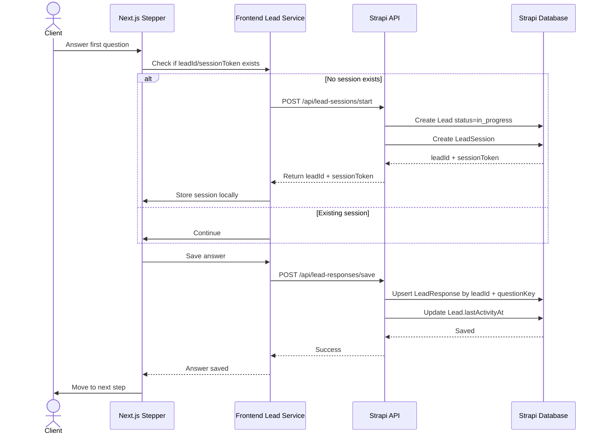
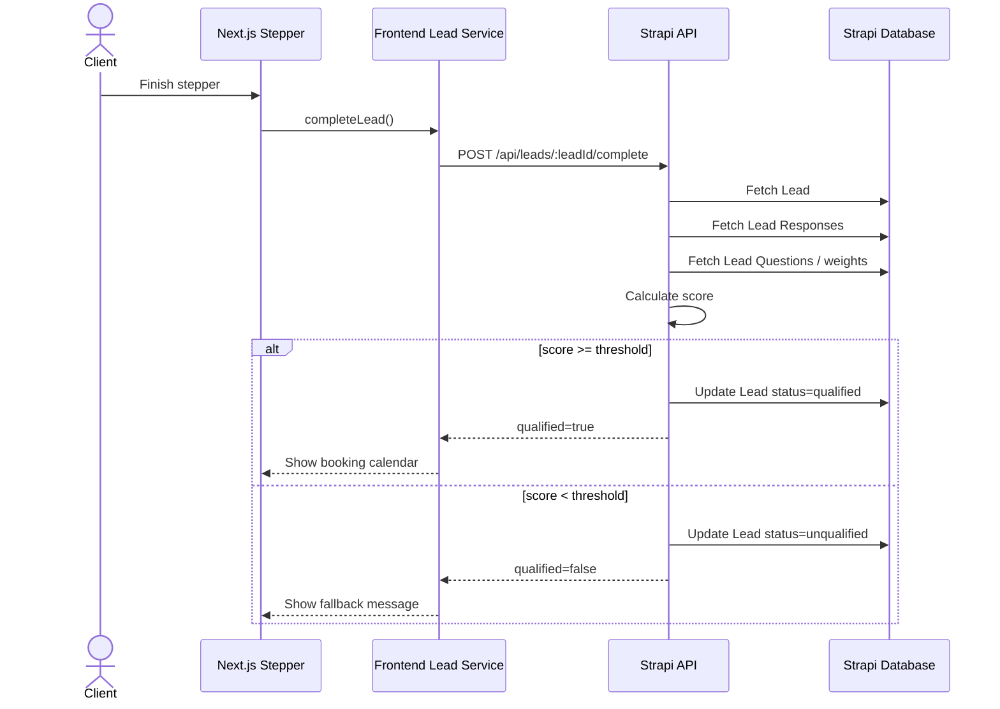
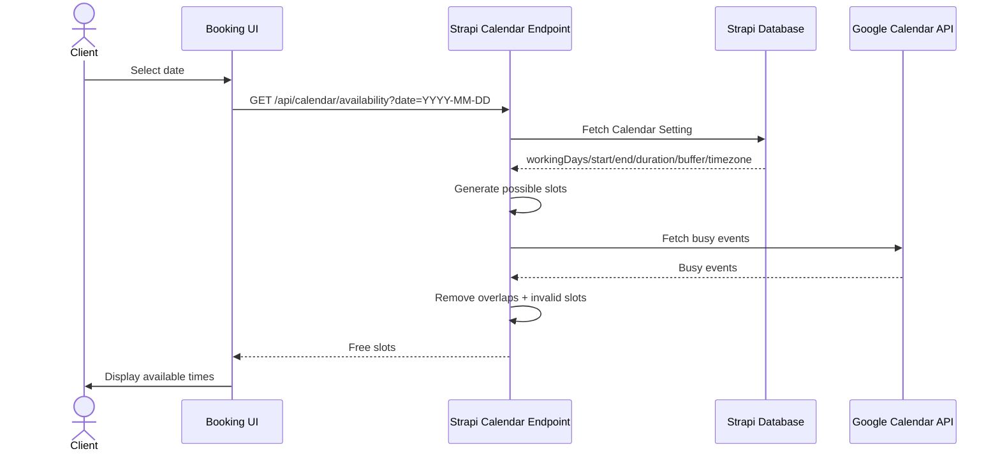
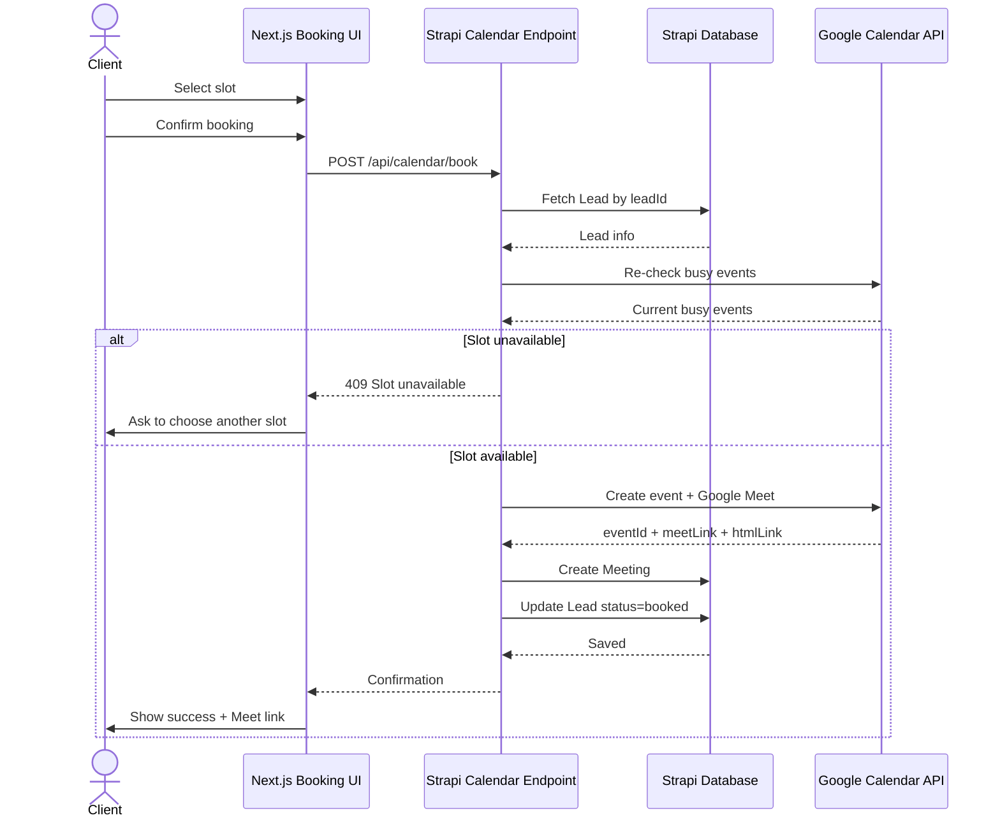
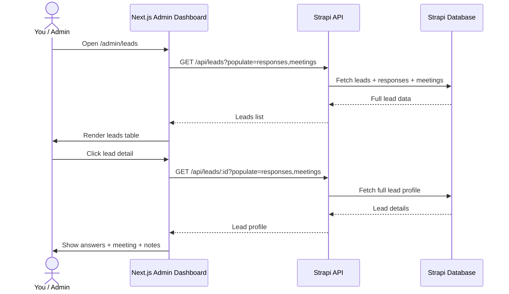

# Injaaz Digital — Lead Qualification Stepper + Google Calendar Booking System

## Purpose

This file is a Codex implementation guide for the `/injaazdigital` project.

The project has:

```txt
/injaazdigital
  /client   → Next.js frontend
  /server   → Strapi backend / CMS / API
```

Goal:

Build a professional lead qualification and booking system where:

```txt
Client clicks "Book Strategy Call"
  → opens /book-call
  → answers a dynamic stepper
  → lead data is saved in Strapi
  → answers are saved progressively
  → lead score is calculated
  → qualified clients see available slots
  → Google Calendar event is created
  → Google Meet link is generated
  → meeting is saved in Strapi
  → admin can see leads, answers, meetings, and pipeline status
```

The final system should behave like a lightweight CRM + booking engine for Injaaz Digital.

---

# 0. Codex Role

Act as a **Principal Full-Stack Architect** and **senior implementation agent**.

You must inspect the existing project before making changes.

Important:

- Do not invent existing file names.
- Reuse existing project conventions where possible.
- Preserve existing design system and styling approach.
- Prefer small, safe, incremental changes.
- Keep Strapi as the control panel and database.
- Keep Google Calendar as the source of truth for real availability.
- Keep Next.js as the client experience and admin dashboard.
- If current files differ from this guide, adapt carefully and explain the adaptation in the final summary.

---

# 1. Existing project assumptions to verify first

Before coding, inspect these areas:

```txt
/client/src/app/(marketing)/book-call/page.js
/client/src/features/book-call/
/client/src/lib/strapi/
/client/src/features/cms/
/client/src/shared/ui/
/client/src/shared/layout/

/server/src/api/lead/
/server/src/api/
/server/src/components/
/server/config/
/server/src/index.ts
```

Existing known behavior:

- `/book-call` already exists.
- There is already a book-call feature.
- There is already a Strapi lead submission flow.
- Current lead form is likely too coupled and should be refactored gradually.
- The project is CMS-driven: Next.js renders Strapi content and blocks.
- Strapi is already used as CMS/backend.

---

# 2. System mental model

```txt
Strapi = Control panel + database
Next.js = Client experience + admin dashboard
Google Calendar = real time availability + event engine
Stepper = qualification funnel
Lead score = sales filter
Meeting = bridge between marketing and sales
```

---

# 3. Main actors

## Client / Website Visitor

Use cases:

```txt
UC-01 Open /book-call
UC-02 Answer qualification questions
UC-03 Submit contact info
UC-04 Complete qualification
UC-05 View available slots
UC-06 Book meeting
UC-07 Receive confirmation
UC-08 Join Google Meet
```

## Admin / Injaaz Digital

Use cases:

```txt
UC-09 Manage lead questions
UC-10 Configure calendar availability
UC-11 View leads
UC-12 View lead answers
UC-13 View booked meetings
UC-14 Join sales call
UC-15 Add call notes
UC-16 Update lead pipeline status
```

## System

Use cases:

```txt
UC-17 Create lead session
UC-18 Save lead responses progressively
UC-19 Calculate lead score
UC-20 Fetch Google Calendar busy events
UC-21 Generate free slots
UC-22 Prevent double booking
UC-23 Create Google Calendar event
UC-24 Generate Google Meet link
UC-25 Save meeting in Strapi
UC-26 Update lead status
```

---

# 4. Target Strapi data model

Create or adapt these Strapi types.

Use Strapi v5 conventions if the current backend is Strapi v5.

## 4.1 Collection Type: `lead-question`

Purpose:

Stores dynamic stepper questions so the admin can edit questions without redeploying the frontend.

Fields:

```txt
title           string       required
key             uid/string   required unique
type            enum         required
options         json         optional
order           integer      required
weight          integer      default 0
required        boolean      default true
active          boolean      default true
helpText        text         optional
placeholder     string       optional
category        string       optional
```

Recommended enum values for `type`:

```txt
select
radio
checkbox
text
textarea
email
phone
url
number
```

Example records:

```json
[
  {
    "title": "What type of business do you run?",
    "key": "business_type",
    "type": "select",
    "options": ["Interior Design", "Real Estate", "Consultant", "E-commerce", "Other"],
    "order": 1,
    "weight": 2,
    "required": true,
    "active": true
  },
  {
    "title": "What is your current main problem?",
    "key": "main_problem",
    "type": "select",
    "options": ["No qualified leads", "Weak website", "Bad positioning", "No clear funnel", "Other"],
    "order": 2,
    "weight": 4,
    "required": true,
    "active": true
  },
  {
    "title": "What is your monthly revenue range?",
    "key": "revenue_range",
    "type": "select",
    "options": ["Less than 10k MAD", "10k-50k MAD", "50k-150k MAD", "150k+ MAD"],
    "order": 3,
    "weight": 5,
    "required": true,
    "active": true
  },
  {
    "title": "What service are you interested in?",
    "key": "service_interest",
    "type": "select",
    "options": ["Growth Engine", "Web Studio", "Both", "Not sure"],
    "order": 4,
    "weight": 3,
    "required": true,
    "active": true
  },
  {
    "title": "Tell us briefly what you want to improve.",
    "key": "project_context",
    "type": "textarea",
    "order": 5,
    "weight": 2,
    "required": false,
    "active": true
  }
]
```

---

## 4.2 Collection Type: `lead`

Purpose:

Stores the business opportunity.

Fields:

```txt
name              string optional
email             email optional
phone             string optional
companyName       string optional
websiteUrl        string optional

status            enum required default "in_progress"
score             integer default 0
sourcePage        string optional
ctaSource         string optional
serviceInterest   string optional

meetingDate       datetime optional
meetingLink       string optional

notes             text optional
lastActivityAt    datetime optional
```

Recommended `status` enum:

```txt
in_progress
partial
completed
unqualified
qualified
booked
attended
no_show
proposal_needed
proposal_sent
closed_won
closed_lost
```

Relations:

```txt
lead has many lead-responses
lead has many meetings
lead has many lead-notes optional
```

---

## 4.3 Collection Type: `lead-response`

Purpose:

Stores every answer independently.

Fields:

```txt
lead              relation many-to-one → lead
question          relation many-to-one → lead-question optional
questionKey       string required
questionTitle     string optional
answer            text/json required
scoreValue        integer default 0
answeredAt        datetime optional
```

Why not store all answers as one JSON only?

Because individual rows allow:

- filtering by answers later
- analytics
- partial save
- easier dashboard display
- better audit trail

Optional extra:

Also store an `answersJson` field on lead for quick reads, but the canonical answers should be `lead-response`.

---

## 4.4 Collection Type: `lead-session`

Purpose:

Tracks incomplete form sessions.

Fields:

```txt
lead              relation one-to-one/many-to-one → lead
sessionToken      string unique
currentStep       integer default 0
completed         boolean default false
startedAt         datetime
completedAt       datetime optional
lastSeenAt        datetime optional
```

Frontend stores:

```txt
leadId
sessionToken
```

Prefer `sessionToken` instead of exposing only raw IDs.

---

## 4.5 Single Type: `calendar-setting`

Purpose:

Stores availability rules controlled from Strapi admin.

Fields:

```txt
workingDays       json required
startTime         string required
endTime           string required
slotDuration      integer required
bufferTime        integer required
timezone          string required
minNoticeHours    integer default 4
maxDaysAhead      integer default 21
calendarId        string default "primary"
```

Example:

```json
{
  "workingDays": ["monday", "tuesday", "wednesday", "thursday", "friday"],
  "startTime": "10:00",
  "endTime": "18:00",
  "slotDuration": 30,
  "bufferTime": 15,
  "timezone": "Africa/Casablanca",
  "minNoticeHours": 4,
  "maxDaysAhead": 21,
  "calendarId": "primary"
}
```

Important:

Strapi stores your rules.  
Google Calendar stores real busy time.

---

## 4.6 Collection Type: `meeting`

Purpose:

Stores booked sales calls.

Fields:

```txt
lead              relation many-to-one → lead
start             datetime required
end               datetime required
duration          integer required
status            enum required default "scheduled"
meetLink          string optional
googleEventId     string optional
googleHtmlLink    string optional
notes             text optional
cancelReason      text optional
```

Recommended `status` enum:

```txt
scheduled
done
canceled
no_show
rescheduled
```

---

## 4.7 Optional Collection Type: `lead-note`

Purpose:

Stores internal sales notes.

Fields:

```txt
lead              relation many-to-one → lead
body              text required
type              enum optional
createdByName     string optional
```

Recommended type enum:

```txt
general
call_note
follow_up
proposal
decision
```

---

# 5. Backend routes and APIs

Implement with Strapi custom routes/controllers/services where needed.

Keep generic CRUD for admin/content-manager.

Create custom public endpoints for the client booking flow.

---

## 5.1 Public endpoint: fetch active questions

Endpoint:

```http
GET /api/lead-questions?sort=order:asc&filters[active][$eq]=true
```

This can use standard Strapi REST.

Frontend should normalize the response.

---

## 5.2 Public endpoint: create lead session

Endpoint:

```http
POST /api/lead-sessions/start
```

Payload:

```json
{
  "sourcePage": "/growth-engine",
  "ctaSource": "hero_book_strategy_call"
}
```

Backend behavior:

```txt
1. Create Lead with:
   - status = in_progress
   - sourcePage
   - ctaSource
   - score = 0

2. Create LeadSession with:
   - lead relation
   - sessionToken
   - currentStep = 0
   - completed = false
   - startedAt = now
   - lastSeenAt = now

3. Return:
   - leadId
   - sessionToken
```

Response:

```json
{
  "leadId": 152,
  "sessionToken": "safe_random_token"
}
```

---

## 5.3 Public endpoint: save response

Endpoint:

```http
POST /api/lead-responses/save
```

Payload:

```json
{
  "leadId": 152,
  "sessionToken": "safe_random_token",
  "questionKey": "business_type",
  "questionTitle": "What type of business do you run?",
  "answer": "Interior Design"
}
```

Backend behavior:

```txt
1. Verify sessionToken belongs to leadId.
2. Verify questionKey exists and is active if possible.
3. Upsert response by leadId + questionKey.
4. Update Lead.lastActivityAt.
5. Update LeadSession.currentStep if provided.
6. Return saved response.
```

Why upsert?

If user goes back and changes an answer, do not create duplicates.

---

## 5.4 Public endpoint: update contact info

Endpoint:

```http
PUT /api/leads/:id/contact
```

Payload:

```json
{
  "sessionToken": "safe_random_token",
  "name": "Ahmed",
  "email": "ahmed@example.com",
  "phone": "+212600000000",
  "companyName": "Ahmed Studio",
  "websiteUrl": "https://example.com"
}
```

Backend behavior:

```txt
1. Verify sessionToken.
2. Validate email.
3. Validate phone format loosely.
4. Sanitize strings.
5. Update Lead.
6. Return updated lead.
```

---

## 5.5 Public endpoint: complete and score lead

Endpoint:

```http
POST /api/leads/:id/complete
```

Payload:

```json
{
  "sessionToken": "safe_random_token"
}
```

Backend behavior:

```txt
1. Verify sessionToken.
2. Fetch lead.
3. Fetch all responses for this lead.
4. Fetch active lead questions.
5. Calculate score.
6. Determine serviceInterest from response if present.
7. Update lead:
   - score
   - status = qualified or unqualified
   - serviceInterest
8. Mark session completed.
9. Return qualification result.
```

Response:

```json
{
  "leadId": 152,
  "qualified": true,
  "score": 14,
  "status": "qualified"
}
```

Qualification threshold:

Start with:

```txt
QUALIFICATION_THRESHOLD = 8
```

Later make it configurable in Strapi.

---

## 5.6 Public endpoint: get calendar availability

Endpoint:

```http
GET /api/calendar/availability?date=2026-04-25
```

Backend behavior:

```txt
1. Fetch calendar-setting from Strapi.
2. Validate date:
   - not past
   - within maxDaysAhead
   - respects minNoticeHours
   - working day only
3. Generate possible slots from startTime → endTime.
4. Add bufferTime between slots.
5. Fetch busy events from Google Calendar.
6. Remove slots that overlap busy events.
7. Remove past slots if selected date is today.
8. Return available slots.
```

Response:

```json
[
  {
    "start": "2026-04-25T10:00:00+01:00",
    "end": "2026-04-25T10:30:00+01:00"
  },
  {
    "start": "2026-04-25T10:45:00+01:00",
    "end": "2026-04-25T11:15:00+01:00"
  }
]
```

---

## 5.7 Public endpoint: book meeting

Endpoint:

```http
POST /api/calendar/book
```

Payload:

```json
{
  "leadId": 152,
  "sessionToken": "safe_random_token",
  "start": "2026-04-25T15:15:00+01:00",
  "end": "2026-04-25T15:45:00+01:00"
}
```

Backend behavior:

```txt
1. Verify sessionToken.
2. Fetch lead.
3. Ensure lead.status is qualified.
4. Re-check slot availability with Google Calendar.
5. If slot unavailable, return 409.
6. Create Google Calendar event.
7. Request Google Meet link.
8. Save Meeting in Strapi.
9. Update Lead:
   - status = booked
   - meetingDate = start
   - meetingLink = meetLink
10. Return confirmation.
```

Response:

```json
{
  "meetingId": 55,
  "status": "booked",
  "start": "2026-04-25T15:15:00+01:00",
  "end": "2026-04-25T15:45:00+01:00",
  "meetLink": "https://meet.google.com/abc-defg-hij"
}
```

---

# 6. Google Calendar integration

## 6.1 Google Cloud setup

Use Google Cloud Console:

```txt
1. Create or select project
2. Enable Google Calendar API
3. Create OAuth 2.0 credentials
4. Configure redirect URI
5. Get refresh token for the calendar owner account
6. Store secrets in server environment variables
```

Required env vars:

```env
GOOGLE_CALENDAR_CLIENT_ID=
GOOGLE_CALENDAR_CLIENT_SECRET=
GOOGLE_CALENDAR_REDIRECT_URI=
GOOGLE_CALENDAR_REFRESH_TOKEN=
GOOGLE_CALENDAR_ID=primary
GOOGLE_CALENDAR_TIMEZONE=Africa/Casablanca
```

Never expose these in the frontend.

---

## 6.2 Backend service file

Suggested location:

```txt
/server/src/services/google-calendar.ts
```

or if following Strapi api module style:

```txt
/server/src/api/calendar/services/google-calendar.ts
```

Service responsibilities:

```txt
getBusyEvents({ start, end, calendarId })
createMeetingEvent({ lead, start, end, timezone })
isSlotFree({ start, end })
```

---

## 6.3 Event creation payload shape

Use `conferenceDataVersion: 1`.

Event should include:

```txt
summary: Strategy Call — {lead.name}
description:
  Lead ID
  Business type
  Main problem
  Service interest
  Score
  Website URL
attendees:
  lead.email
conferenceData:
  createRequest:
    requestId: unique string
    conferenceSolutionKey:
      type: hangoutsMeet
```

---

# 7. Frontend architecture

Refactor or create feature:

```txt
/client/src/features/book-call/
  components/
    BookCallPage.jsx
    LeadStepper.jsx
    StepRenderer.jsx
    QuestionInput.jsx
    BookingCalendar.jsx
    BookingConfirmation.jsx
    BookingFallback.jsx
    ProgressBar.jsx

  hooks/
    useLeadSession.js
    useBookingAvailability.js

  services/
    lead.service.js
    calendar.service.js

  utils/
    normalizeQuestions.js
    validation.js
    scoringPreview.js optional

  constants/
    bookCall.constants.js
```

If the project uses TypeScript in some areas, TypeScript is preferred.  
If the existing book-call feature is JS, stay consistent unless the repo already supports TS cleanly.

---

## 7.1 `/book-call` page responsibilities

Location:

```txt
/client/src/app/(marketing)/book-call/page.js
```

Responsibilities:

```txt
- render BookCallPage
- do not contain heavy form logic
- preserve existing layout conventions
```

---

## 7.2 `BookCallPage`

Responsibilities:

```txt
- fetch active questions
- control overall flow:
  1. stepper
  2. qualification result
  3. booking calendar
  4. confirmation / fallback
```

States:

```txt
loadingQuestions
stepper
qualified
booking
confirmed
unqualified
error
```

---

## 7.3 `LeadStepper`

Responsibilities:

```txt
- display one question at a time
- show progress
- validate current answer
- call saveAnswer on next
- call completeLead when final question is done
```

Must support:

```txt
select
radio
checkbox
text
textarea
email
phone
url
number
```

---

## 7.4 `useLeadSession`

Responsibilities:

```txt
- hold leadId and sessionToken
- create session when first answer is saved
- persist session in localStorage
- save answer progressively
- update contact info
- complete lead
- expose status and errors
```

Suggested API:

```js
const {
  leadId,
  sessionToken,
  answers,
  currentStep,
  isSaving,
  error,
  saveAnswer,
  updateContact,
  completeLead,
  nextStep,
  previousStep
} = useLeadSession();
```

---

## 7.5 `BookingCalendar`

Responsibilities:

```txt
- show selectable dates
- call /api/calendar/availability
- show free slots
- call /api/calendar/book
- handle slot unavailable errors
- show confirmation
```

Important UX:

```txt
- loading state while fetching slots
- disabled slots if no availability
- clear timezone label: Africa/Casablanca
- confirmation screen after booking
```

---

# 8. Admin dashboard

Build simple internal admin pages if not already present.

Suggested routes:

```txt
/client/src/app/admin/leads/page.js
/client/src/app/admin/leads/[id]/page.js
/client/src/app/admin/meetings/page.js
```

If there is no auth yet, implement carefully:

- For MVP, protect via basic environment flag or hidden route only if acceptable.
- Production should use auth.
- Do not expose private lead data publicly.

---

## 8.1 Leads dashboard

Endpoint:

```http
GET /api/leads?populate=lead_responses,meetings
```

Display columns:

```txt
Name
Email
Phone
Status
Score
Service Interest
Source Page
Meeting Date
Created At
Action
```

Actions:

```txt
View details
Open Meet link
Update status
Add note
```

---

## 8.2 Lead detail page

Show:

```txt
Lead identity:
- name
- email
- phone
- company
- website

Funnel:
- sourcePage
- ctaSource
- status
- score

Answers:
- question title
- answer

Meeting:
- date/time
- meet link
- Google event ID
- status

Internal:
- notes
- status update
```

---

## 8.3 Meetings dashboard

Endpoint:

```http
GET /api/meetings?populate=lead&filters[status][$eq]=scheduled
```

Display:

```txt
Date
Time
Lead
Email
Status
Meet Link
Action
```

Actions:

```txt
Open Meet
Mark Done
Mark No Show
Cancel
```

---

# 9. Full sequence diagrams

## 9.1 Global flow

```mermaid
flowchart TD
    A[Client visits website] --> B[Clicks Book Strategy Call]
    B --> C[/book-call page opens]
    C --> D[Fetch active questions from Strapi]
    D --> E[Render dynamic stepper]
    E --> F[Client answers questions]
    F --> G[Create or update Lead in Strapi]
    G --> H[Save each answer as Lead Response]
    H --> I[Complete stepper]
    I --> J[Calculate lead score]
    J --> K{Qualified?}

    K -- No --> L[Show fallback message]
    L --> M[Save lead as unqualified]

    K -- Yes --> N[Show booking calendar]
    N --> O[Fetch availability]
    O --> P[Read Calendar Settings from Strapi]
    P --> Q[Read busy events from Google Calendar]
    Q --> R[Generate free slots]
    R --> S[Client selects slot]
    S --> T[Create Google Calendar event]
    T --> U[Generate Google Meet link]
    U --> V[Save Meeting in Strapi]
    V --> W[Update Lead status to booked]
    W --> X[Show confirmation page]
    X --> Y[Admin sees lead + meeting in dashboard]
```

---

## 9.2 Stepper progressive save



---

## 9.3 Qualification



---

## 9.4 Availability



---

## 9.5 Booking



---

## 9.6 Admin dashboard



---

# 10. Implementation phases

## Phase 1 — Inspect current code

Tasks:

```txt
1. Inspect existing /book-call route.
2. Inspect existing HomeworkForm or book-call components.
3. Inspect existing Strapi lead API.
4. Inspect existing strapi client/query helpers.
5. Decide whether to refactor existing lead-submissions or add new APIs beside it.
```

Acceptance:

```txt
- You know exactly where the current form sends data.
- You know existing lead schema.
- You know current frontend design style.
```

---

## Phase 2 — Add Strapi content types

Tasks:

```txt
1. Create lead-question collection type.
2. Update or create lead collection type.
3. Create lead-response collection type.
4. Create lead-session collection type.
5. Create calendar-setting single type.
6. Create meeting collection type.
7. Optional: create lead-note collection type.
```

Acceptance:

```txt
- All content types appear in Strapi Content Manager.
- Admin can create questions.
- Admin can configure calendar-setting.
- Admin can see leads and meetings.
```

---

## Phase 3 — Add lead custom endpoints

Tasks:

```txt
1. Add /api/lead-sessions/start.
2. Add /api/lead-responses/save.
3. Add /api/leads/:id/contact.
4. Add /api/leads/:id/complete.
5. Add validation and sanitization.
6. Add scoring service.
```

Acceptance:

```txt
- New lead session can be created.
- Answer can be saved.
- Same answer can be updated without duplicates.
- Lead can be completed and scored.
- Qualified/unqualified status is saved.
```

---

## Phase 4 — Build dynamic stepper frontend

Tasks:

```txt
1. Fetch questions from Strapi.
2. Render question based on type.
3. Create session on first answer.
4. Save each answer on next.
5. Save contact info.
6. Complete lead.
7. Show booking if qualified.
8. Show fallback if unqualified.
```

Acceptance:

```txt
- /book-call renders questions from Strapi.
- No hardcoded question list required in frontend.
- Partial answers are saved.
- Qualification works.
```

---

## Phase 5 — Google Calendar integration

Tasks:

```txt
1. Add Google Calendar env vars.
2. Add google-calendar service.
3. Implement getBusyEvents.
4. Implement createMeetingEvent.
5. Implement slot overlap check.
6. Implement meet link generation.
```

Acceptance:

```txt
- Backend can fetch busy events.
- Backend can create a Google Calendar event.
- Event includes Google Meet link.
- Secrets never reach frontend.
```

---

## Phase 6 — Availability API

Tasks:

```txt
1. Add /api/calendar/availability.
2. Fetch calendar-setting.
3. Generate slots from rules.
4. Fetch busy events.
5. Remove overlaps.
6. Return free slots.
```

Acceptance:

```txt
- Frontend receives only free slots.
- Busy Google Calendar events are not shown.
- Past slots are not shown.
- Non-working days return no slots.
```

---

## Phase 7 — Booking API + UI

Tasks:

```txt
1. Add /api/calendar/book.
2. Re-check slot before booking.
3. Create Google Calendar event.
4. Save meeting in Strapi.
5. Update lead to booked.
6. Build BookingCalendar UI.
7. Build confirmation screen.
```

Acceptance:

```txt
- Client can book a free slot.
- Double booking is prevented.
- Meeting appears in Google Calendar.
- Meeting appears in Strapi.
- Lead status becomes booked.
```

---

## Phase 8 — Admin dashboard

Tasks:

```txt
1. Build /admin/leads.
2. Build lead detail view.
3. Build /admin/meetings.
4. Add status update actions.
5. Add internal notes if lead-note is implemented.
```

Acceptance:

```txt
- Admin can see all leads.
- Admin can see all answers.
- Admin can see booked meetings.
- Admin can open Meet link.
- Admin can update status.
```

---

# 11. Validation rules

Frontend:

```txt
- Required answers cannot be empty.
- Email must be valid.
- Phone should be loose-valid.
- Website URL should be valid if provided.
- Disable next button while saving.
- Show clear error if save fails.
```

Backend:

```txt
- Validate sessionToken.
- Sanitize all string inputs.
- Rate-limit public endpoints if possible.
- Prevent duplicate responses.
- Prevent double booking.
- Do not allow booking for unqualified lead.
- Do not allow booking outside calendar-setting rules.
```

---

# 12. Error states

Handle these clearly:

```txt
questions_load_failed
session_create_failed
answer_save_failed
contact_save_failed
qualification_failed
availability_load_failed
slot_unavailable
booking_failed
google_calendar_failed
```

UX behavior:

```txt
- Keep user on current step if save fails.
- Do not lose answers.
- If slot unavailable, refresh availability.
- If Google Calendar fails, show retry message.
```

---

# 13. Security notes

Critical:

```txt
- Do not expose Google tokens to frontend.
- Do not expose admin lead dashboard publicly.
- Use sessionToken for public write operations.
- Validate leadId + sessionToken pair.
- Sanitize all free-text fields.
- Do not trust frontend score.
- Score must be calculated backend-side.
```

---

# 14. Recommended file structure

## Frontend

```txt
/client/src/features/book-call/
  components/
    BookCallPage.jsx
    LeadStepper.jsx
    StepRenderer.jsx
    QuestionInput.jsx
    BookingCalendar.jsx
    BookingConfirmation.jsx
    BookingFallback.jsx
    ProgressBar.jsx

  hooks/
    useLeadSession.js
    useBookingAvailability.js

  services/
    lead.service.js
    calendar.service.js

  utils/
    normalizeQuestions.js
    validation.js

  constants/
    bookCall.constants.js
```

## Backend

```txt
/server/src/api/lead-question/
  content-types/lead-question/schema.json
  controllers/lead-question.ts
  routes/lead-question.ts
  services/lead-question.ts

/server/src/api/lead/
  content-types/lead/schema.json
  controllers/lead.ts
  routes/lead.ts
  services/lead.ts

/server/src/api/lead-response/
  content-types/lead-response/schema.json
  controllers/lead-response.ts
  routes/lead-response.ts
  services/lead-response.ts

/server/src/api/lead-session/
  content-types/lead-session/schema.json
  controllers/lead-session.ts
  routes/lead-session.ts
  services/lead-session.ts

/server/src/api/calendar-setting/
  content-types/calendar-setting/schema.json
  controllers/calendar-setting.ts
  routes/calendar-setting.ts
  services/calendar-setting.ts

/server/src/api/meeting/
  content-types/meeting/schema.json
  controllers/meeting.ts
  routes/meeting.ts
  services/meeting.ts

/server/src/api/calendar/
  controllers/calendar.ts
  routes/calendar.ts
  services/calendar.ts
  services/google-calendar.ts
  services/availability.ts
```

Adapt names to Strapi conventions already used in the repo.

---

# 15. Example API service contracts for frontend

## `lead.service.js`

```js
export async function fetchLeadQuestions() {}

export async function startLeadSession({ sourcePage, ctaSource }) {}

export async function saveLeadAnswer({
  leadId,
  sessionToken,
  questionKey,
  questionTitle,
  answer
}) {}

export async function updateLeadContact({
  leadId,
  sessionToken,
  name,
  email,
  phone,
  companyName,
  websiteUrl
}) {}

export async function completeLead({ leadId, sessionToken }) {}
```

## `calendar.service.js`

```js
export async function fetchAvailability({ date }) {}

export async function bookMeeting({
  leadId,
  sessionToken,
  start,
  end
}) {}
```

---

# 16. Done definition

The task is complete only when:

```txt
1. Admin can create questions in Strapi.
2. /book-call fetches questions dynamically.
3. Client can answer the stepper.
4. A lead is created in Strapi.
5. Each answer is saved in Strapi.
6. Lead can be completed and scored.
7. Qualified clients see booking slots.
8. Availability uses Strapi calendar-setting + Google Calendar busy events.
9. Booking creates Google Calendar event + Google Meet link.
10. Meeting is saved in Strapi.
11. Lead status becomes booked.
12. Admin can see leads and meetings.
13. Admin can open the meeting link.
14. Public endpoints validate sessionToken.
15. Google credentials are backend-only.
```

---

# 17. Short expert prompts for Codex

Use these prompts one by one.

## Prompt 1 — Inspect first

```txt
Act as a Principal Full-Stack Architect. Inspect `/injaazdigital/client` and `/injaazdigital/server` before coding. Find the current `/book-call` flow, existing lead submission API, Strapi content types, frontend Strapi query helpers, and styling/component conventions. Then produce a short implementation map showing exactly which files you will add or modify for the lead qualification + Google Calendar booking system. Do not code yet.
```

---

## Prompt 2 — Strapi schemas

```txt
Implement the Strapi data model for the booking funnel. Add or adapt content types for lead-question, lead, lead-response, lead-session, calendar-setting, meeting, and optionally lead-note. Follow existing Strapi v5 conventions in this repo. Preserve existing lead functionality. Add clean relations, enums, and fields exactly as described in `injaazdigital_booking_lead_funnel_codex_plan.md`. After implementation, summarize created files and any adaptations.
```

---

## Prompt 3 — Lead session APIs

```txt
Implement the custom Strapi public endpoints for the stepper flow: start lead session, save/upsert lead response, update contact info, and complete/score lead. Add validation, sanitization, sessionToken verification, duplicate-answer prevention, and backend-only scoring. Keep controllers thin and move reusable logic into services. Follow the project’s current Strapi route/controller/service style.
```

---

## Prompt 4 — Dynamic frontend stepper

```txt
Refactor `/book-call` into a dynamic lead qualification stepper. Fetch active lead questions from Strapi, render fields by type, create a lead session on first answer, save each answer progressively, save contact info, complete the lead, and route qualified users into booking while showing a fallback for unqualified users. Follow the existing Next.js styling and component patterns.
```

---

## Prompt 5 — Google Calendar backend

```txt
Implement Google Calendar integration in the Strapi backend. Add a secure backend-only service that uses env vars for OAuth credentials and refresh token. Implement fetching busy events, generating Google Meet event links, and creating calendar events. Do not expose secrets to the frontend. Use Africa/Casablanca timezone by default.
```

---

## Prompt 6 — Availability and booking APIs

```txt
Implement `/api/calendar/availability` and `/api/calendar/book`. Availability must read calendar-setting from Strapi, generate slots, fetch Google Calendar busy events, remove overlaps, respect buffer/min notice/max days ahead, and return free slots. Booking must verify sessionToken, ensure the lead is qualified, re-check the slot, create a Google Calendar event with Meet link, save a meeting in Strapi, and update lead status to booked.
```

---

## Prompt 7 — Booking UI

```txt
Build the booking UI inside the `/book-call` flow. After qualification, show date selection, fetch available slots, allow the client to confirm a slot, handle slot unavailable errors, then show a confirmation screen with date/time and Meet link. Keep UX clean, calm, and consistent with the Injaaz Digital site.
```

---

## Prompt 8 — Admin dashboard

```txt
Build internal admin pages in Next.js for `/admin/leads`, `/admin/leads/[id]`, and `/admin/meetings` if they do not already exist. Display leads with status, score, source, service interest, meeting date, and actions. The lead detail page must show contact info, all stepper answers, meeting info, status update, and notes if supported. Protect these routes according to the current app’s auth/security capabilities; do not expose private lead data publicly.
```

---

## Prompt 9 — Final QA

```txt
Perform a full QA pass of the lead qualification and booking system. Test the full journey: open /book-call, fetch questions, start session, save answers, update contact, complete/score lead, show availability, book meeting, create Google Calendar event, save meeting, update lead, and view it in admin dashboard. Fix bugs, edge cases, loading states, validation errors, and double-booking risks. Provide a final implementation summary with changed files.
```

---

# 18. Final implementation order for Codex

```txt
1. Inspect current code
2. Add Strapi schemas
3. Add backend services/controllers/routes for lead session
4. Add frontend dynamic stepper
5. Add Google Calendar service
6. Add availability endpoint
7. Add booking endpoint
8. Add booking UI
9. Add admin dashboard
10. QA full flow
```

---

# 19. Expected final user journey

```txt
1. Client clicks "Book Strategy Call".
2. Client lands on /book-call.
3. Stepper questions load from Strapi.
4. Client answers question 1.
5. System creates lead + lead session.
6. System saves answer 1.
7. Client continues answering.
8. System saves each answer.
9. Client submits contact info.
10. System updates lead contact fields.
11. Client finishes stepper.
12. Backend calculates score.
13. If unqualified, client sees fallback.
14. If qualified, client sees booking calendar.
15. Client picks date.
16. System fetches free slots from Strapi rules + Google busy events.
17. Client chooses time.
18. Backend re-checks slot.
19. Backend creates Google Calendar event.
20. Google Meet link is generated.
21. Backend saves meeting in Strapi.
22. Backend updates lead to booked.
23. Client sees confirmation.
24. Admin sees lead + answers + meeting in dashboard.
25. Admin joins call and updates pipeline.
```

---

# 20. Important final instruction for Codex

Do not build this as a random form.

Build it as:

```txt
Lead Qualification Funnel
  + Booking Engine
  + Strapi CRM Data
  + Google Calendar Time Engine
```

Every implementation decision should preserve that model.
